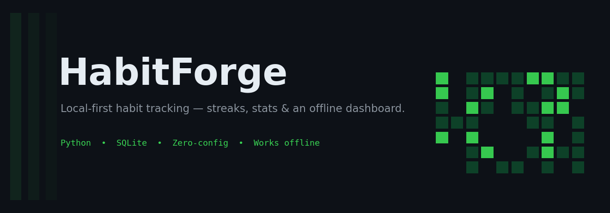
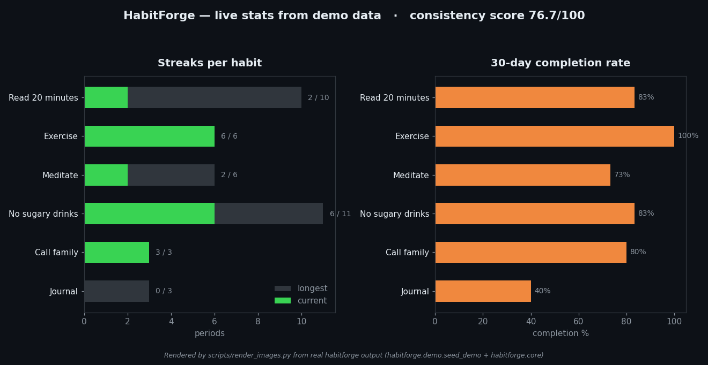

# 🔥 HabitForge

**Forge streaks. Build consistency.** A local-first habit tracker with streaks, completion stats, and a beautiful offline dashboard — your data never leaves your machine.




## Why HabitForge?

Most habit apps want your email, your subscription, and your data on their servers. HabitForge is the opposite: a fast CLI + a single SQLite file + a dashboard that renders to one self-contained HTML file. No accounts. No network. No API keys. Double-click the dashboard and it just works — on a plane, in a cabin, anywhere.


*Real output: streaks and 30-day completion rates computed by HabitForge from seeded demo data.*

## Features

- **Fast CLI** — add habits, log check-ins, and see today's list in seconds.
- **Real streak engine** — current and longest streaks with correct daily *and* weekly cadence handling. A missed full period breaks the streak; an in-progress period keeps it alive.
- **Weekly targets** — "Exercise 3x/week" counts a week complete only when the target is met.
- **Completion stats** — per-habit rates over trailing 7/30 days, plus an overall **consistency score** (0–100).
- **Offline HTML dashboard** — habit cards, streak badges 🏆, 12-week heatmaps, and stats in a single self-contained HTML file with inline CSS. Zero external assets.
- **Demo mode** — one command seeds 6 weeks of realistic history so the dashboard looks alive immediately.
- **Zero-config storage** — everything lives in one SQLite file (`~/.habitforge/habits.db` by default; override with `--db` or `HABITFORGE_DB`).

## Tech stack

| Layer | Choice |
|---|---|
| Language | Python 3.10+, **stdlib-only** at runtime (`sqlite3`, `argparse`, `datetime`) |
| Storage | SQLite — single local DB file, WAL-free, zero config |
| Dashboard | Hand-rolled HTML + inline CSS generator (no JS, no CDN, works offline) |
| Tests | pytest — 37 tests covering streak math, stats, persistence, CLI, dashboard |
| Dev tooling | matplotlib (README images only, not a runtime dependency) |

## Quickstart

No installs beyond Python 3.10+. Everything runs out of the box:

```bash
git clone https://github.com/872000/habitforge.git
cd habitforge

# See it alive in 10 seconds: seed 6 weeks of realistic sample data
python -m habitforge demo

# Your daily loop
python -m habitforge today
python -m habitforge checkin "Read 20 minutes"

# Streaks, stats, and the dashboard
python -m habitforge streaks
python -m habitforge stats
python -m habitforge dashboard        # writes habitforge-dashboard.html — open it in any browser

# Run the test suite
python -m pytest
```

### CLI reference

```bash
python -m habitforge add "Meditate" --frequency daily
python -m habitforge add "Exercise" --frequency weekly --target 3
python -m habitforge checkin "Exercise" --date 2026-09-28 --note "morning run"
python -m habitforge today        # today's list with check-in status
python -m habitforge list         # all habits
python -m habitforge streaks      # current vs longest streaks
python -m habitforge stats        # 7/30-day rates + consistency score
python -m habitforge dashboard -o dashboard.html --weeks 12
python -m habitforge remove "Old habit" --yes
python -m habitforge --db ./my-habits.db today   # custom database location
```

### How streaks work

A habit is *complete* for a period when its check-ins meet the target. The **current streak** is the trailing run of completed periods — it survives while the current period is still in progress, and drops to 0 once a full period passes uncompleted. The **longest streak** is the best run ever. Daily habits measure days; weekly habits measure ISO weeks (Monday–Sunday).

## Project structure

```
habitforge/
├── habitforge/           # the package (stdlib-only)
│   ├── cli.py            # argparse CLI: add, checkin, today, streaks, stats, dashboard, demo
│   ├── core.py           # streak + stats engine (pure functions, fully tested)
│   ├── dates.py          # period arithmetic for daily/weekly cadences
│   ├── dashboard.py      # self-contained offline HTML dashboard generator
│   ├── db.py             # SQLite persistence layer (single local DB file)
│   └── demo.py           # deterministic realistic sample-data seeder
├── tests/                # 37 pytest tests (streaks, stats, db, CLI, dashboard, demo)
├── scripts/
│   └── render_images.py  # regenerates docs/*.png from real program output
├── docs/
│   ├── hero.png          # project banner
│   └── screenshot.png    # real stats chart rendered from demo data
├── pyproject.toml
├── LICENSE               # MIT
└── README.md
```

## Roadmap

- [ ] Habit archiving (pause without losing history)
- [ ] Per-habit reminders via local notifications
- [ ] CSV/JSON export and import
- [ ] Streak "freeze" / rest days for weekly targets
- [ ] Dark/light theme toggle on the dashboard
- [ ] `pip install habitforge` release on PyPI

---

Built with Python's standard library. Your habits are yours — HabitForge just keeps the score. 🔥
